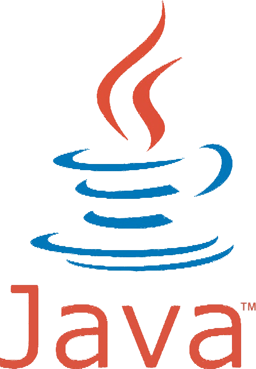
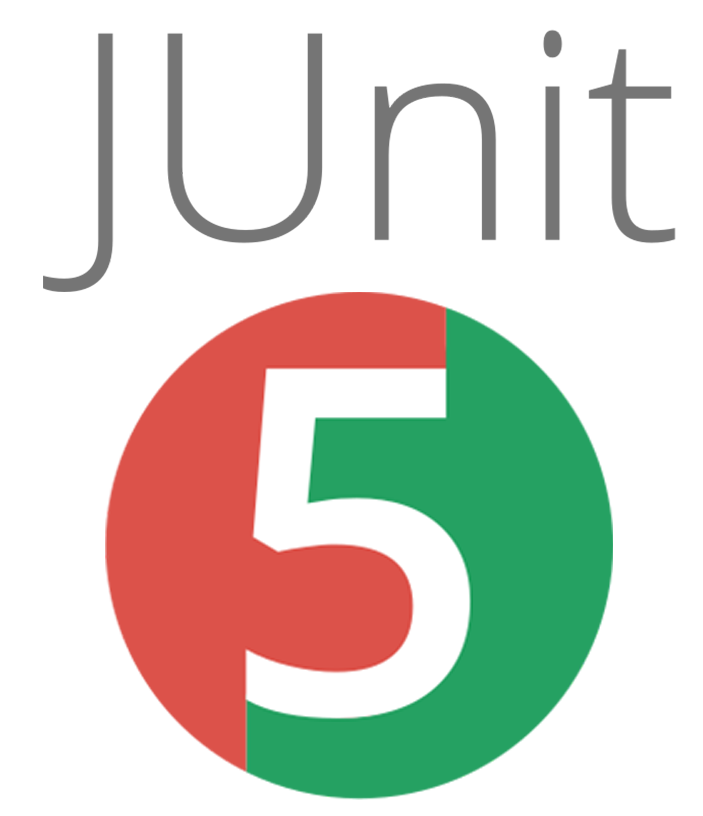

# School of Computing &mdash; Year 4 Project

## SecureYAC

|            |                              |
|------------|------------------------------|
|Supervisor: | Geoff Hamilton               |
|Student:    | Eryk Zygmunt Styczynski      |
|Student:    | Liucija Paulina Adomaviciute |
---------------------------------------------

SecureYAC is a messaging application with a focus on encryption and security. The goal of the project is to provide a cryptographically secure communications channel that does not depend on third-parties.  It establishes a direct connection between users using a custom peer-to-peer networking protocol based on Tox. The identity creation, verification, and authentication is handled by the X3DH key agreement protocol. The users export key bundles and share them with others to establish connection and the Double Ratchet algorithm is used to exchange encrypted messages.

**Project Areas:**
* Cryptography
* Security
* Instant Messaging

**Technologies Used:**

